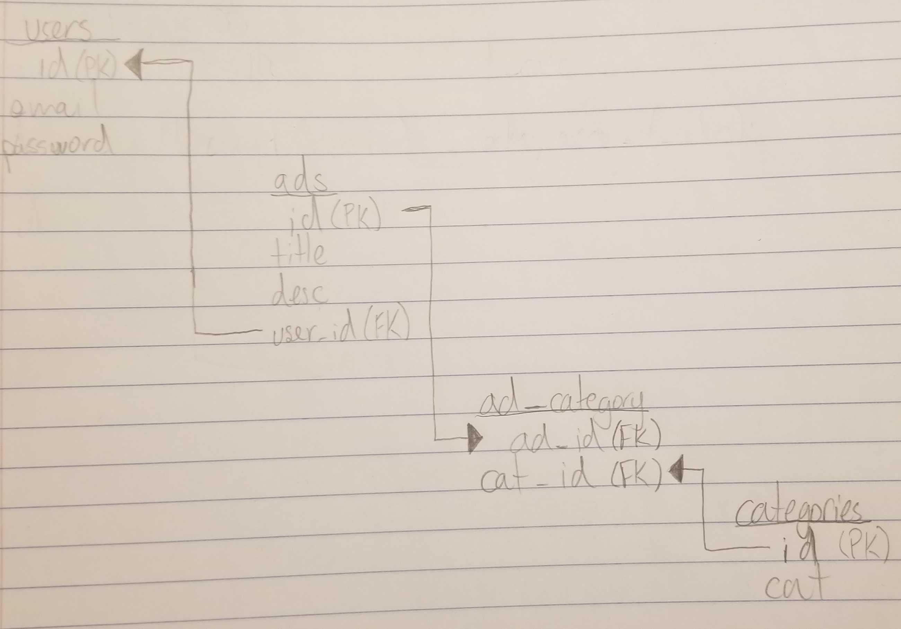

# Database Design

## Adlister Application
Let's design the database for AdLister! The adlister is a small scale craigslist clone where users can post ads for items.

### Specifications

* Users sign up for the site with an email and password
* Users create ads with a title and description and category.
* Each ad is associated with the user that created it.
* An ad can be in one or more categories (for example, "help wanted", "giveaway", or "furniture")

#### Users sign up for the site with an email and password

For this we will need a users table in the database with 3 columns:

* id
* email
* password

#### Users create ads with a title and description and category.

For this we will need a ads table in the database with 3 columns:

* id
* title
* description

We won't add the the category right now since each ad can belong to multiple categories.

#### Each ad is associated with the user that created it.

For this we will need to add 1 column to the ads table:

* user_id

#### An ad can be in one or more categories (for example, "help wanted", "giveaway", or "furniture"):

For this we will need to create two tables since this causes a many to many relationship:

* categories
    * ad_id
    * cat_id
* ad_category
    * id
    * category
    
This will allow us to efficiently story all categories that an add belongs to.


### Creation

#### First let's sketch out the database:



#### Now let's write the SQL to make these tables

##### Users:

```mysql
CREATE TABLE users (
	id INTEGER UNSIGNED NOT NULL AUTO_INCREMENT,
	email NVARCHAR(254) NOT NULL,
	passw VARCHAR(30) NOT NULL,
	PRIMARY KEY (id)
);
```

```mysql
INSERT INTO users(email, passw) VALUES
	('coolcat93@gmail.com', 'catsarec00l'),
	('fancypants@yahoo.com', 'shiny_trousers_93'),
	('hardrocklife@hotmail.com', 'needMOREcowbell1234');
```

**Results**:

| id | email                    | passw               |
|----|--------------------------|---------------------|
| 1  | coolcat93@gmail.com      | catsarec00l         |
| 2  | fancypants@yahoo.com     | shiny_trousers_93   |
| 3  | hardrocklife@hotmail.com | needMOREcowbell1234 |

##### Ads:

```mysql
CREATE TABLE ads (
	id INTEGER UNSIGNED NOT NULL AUTO_INCREMENT,
	title VARCHAR(120) NOT NULL,
	description TEXT NOT NULL,
	user_id INTEGER UNSIGNED NOT NULL,
	PRIMARY KEY (id),
	FOREIGN KEY (user_id) REFERENCES users(id)
);
```

``` mysql
INSERT INTO ads(title, description, user_id) VALUES
	('Take my Couch!', 'I have a couch that is a little smelly now so you can have it.', 1),
	('COWBELL PLAYER NEEDED', 'My band has a gig coming up and we lost our cowbell player. We can offer you free drinks and a portion of our tips.', 3),
	('FREE TICKETS!!!', 'Come see an awesome concert! Brand new cowbell player! Lots of great songs!', 3),
	('Will Trade For Pants', 'I have like cool pants so send me a pic of the pants and I trade you something for them.', 2);
```

**Results**:

| id | title                 | description                                                                                                         | user_id |
|----|-----------------------|---------------------------------------------------------------------------------------------------------------------|---------|
| 1  | Take my Couch!        | I have a couch that is a little smelly now so you can have it.                                                      | 1       |
| 2  | COWBELL PLAYER NEEDED | My band has a gig coming up and we lost our cowbell player. We can offer you free drinks and a portion of our tips. | 3       |
| 3  | FREE TICKETS!!!       | Come see an awesome concert! Brand new cowbell player! Lots of great songs!                                         | 3       |
| 4  | Will Trade For Pants  | I have like cool pants so send me a pic of the pants and I trade you something for them.                            | 2       |

##### Categories

```mysql
CREATE TABLE categories(
	id INTEGER UNSIGNED NOT NULL AUTO_INCREMENT,
	cat VARCHAR(30),
	PRIMARY KEY (id)
);
```

```mysql
INSERT INTO categories(cat) VALUES
	('Help Wanted'),
	('Giveaway'),
	('Furniture'),
	('Trade'),
	('Clothing');
```

**Results**:

| id | cat         |
|----|-------------|
| 1  | Help Wanted |
| 2  | Giveaway    |
| 3  | Furniture   |
| 4  | Trade       |
| 5  | Clothing    |

##### Ad_category Join Table

```mysql
CREATE TABLE ad_category(
	ad_id INTEGER UNSIGNED NOT NULL,
	cat_id INTEGER UNSIGNED NOT NULL,
	FOREIGN KEY (ad_id) REFERENCES ads(id),
	FOREIGN KEY (cat_id) REFERENCES categories(id)
);
```

```mysql
INSERT INTO ad_category(ad_id, cat_id) VALUES
	(1, 2),
	(1, 3),
	(2, 1),
	(3, 2),
	(4, 4),
	(4, 5);
```

**Results**

| ad_id | cat_id |
|-------|--------|
| 1     | 2      |
| 1     | 3      |
| 2     | 1      |
| 3     | 2      |
| 4     | 4      |
| 4     | 5      |

### Queries

Write SQL queries to answer the following questions:

#### 1. For a given ad, what is the email address of the user that created it?

##### Query:

```mysql
SELECT title, description, email
FROM ads a
JOIN users u ON u.id  = a.user_id
```

##### Results:

| title                 | description                                                                                                         | email                    |
|-----------------------|---------------------------------------------------------------------------------------------------------------------|--------------------------|
| Take my Couch!        | I have a couch that is a little smelly now so you can have it.                                                      | coolcat93@gmail.com      |
| COWBELL PLAYER NEEDED | My band has a gig coming up and we lost our cowbell player. We can offer you free drinks and a portion of our tips. | coolcat93@gmail.com      |
| FREE TICKETS!!!       | Come see an awesome concert! Brand new cowbell player! Lots of great songs!                                         | hardrocklife@hotmail.com |
| Will Trade For Pants  | I have like cool pants so send me a pic of the pants and I trade you something for them.                            | fancypants@yahoo.com     |

#### 2. For a given ad, what category, or categories, does it belong to?

##### Query:

```mysql
SELECT title, description, cat
FROM ads a
JOIN ad_category ac ON ac.ad_id  = a.id
JOIN categories c ON ac.cat_id = c.id
```

##### Results:

| title                 | description                                                                                                         | cat         |
|-----------------------|---------------------------------------------------------------------------------------------------------------------|-------------|
| Take my Couch!        | I have a couch that is a little smelly now so you can have it.                                                      | Giveaway    |
| Take my Couch!        | I have a couch that is a little smelly now so you can have it.                                                      | Furniture   |
| COWBELL PLAYER NEEDED | My band has a gig coming up and we lost our cowbell player. We can offer you free drinks and a portion of our tips. | Help Wanted |
| FREE TICKETS!!!       | Come see an awesome concert! Brand new cowbell player! Lots of great songs!                                         | Giveaway    |
| Will Trade For Pants  | I have like cool pants so send me a pic of the pants and I trade you something for them.                            | Trade       |
| Will Trade For Pants  | I have like cool pants so send me a pic of the pants and I trade you something for them.                            | Clothing    |

#### 3. For a given category, show all the ads that are in that category.

##### Query:

```mysql
SELECT cat, title, description
FROM ads a
JOIN ad_category ac ON ac.ad_id  = a.id
JOIN categories c ON ac.cat_id = c.id
WHERE cat = 'Giveaway'
```

##### Results:

| cat      | title           | description                                                                 |
|----------|-----------------|-----------------------------------------------------------------------------|
| Giveaway | Take my Couch!  | I have a couch that is a little smelly now so you can have it.              |
| Giveaway | FREE TICKETS!!! | Come see an awesome concert! Brand new cowbell player! Lots of great songs! |

#### 4. For a given user, show all the ads they have posted.

##### Query:

```mysql
SELECT user_id, email, title, description
FROM ads a
JOIN users u ON u.id = a.user_id
WHERE user_id = 3
```

##### Results:

| user_id | email                    | title                 | description                                                                                                         |
|---------|--------------------------|-----------------------|---------------------------------------------------------------------------------------------------------------------|
| 3       | hardrocklife@hotmail.com | COWBELL PLAYER NEEDED | My band has a gig coming up and we lost our cowbell player. We can offer you free drinks and a portion of our tips. |
| 3       | hardrocklife@hotmail.com | FREE TICKETS!!!       | Come see an awesome concert! Brand new cowbell player! Lots of great songs!                                         |
